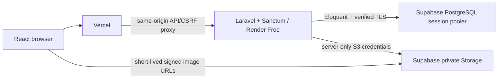

# Architecture, API and permissions

## Intended deployment

Locally Vite proxies the same routes to Laravel; PostgreSQL and private local image storage require no production credentials. Deployed Vercel proxy sessions, CSRF, private photos and backend-redeploy persistence pass; dated evidence and remaining checks are in validation.md.

Session cookies are host-only, HttpOnly, SameSite=Lax and Secure in production. The browser obtains CSRF state from `/sanctum/csrf-cookie` before writes. Laravel rotates sessions on login and invalidates logout sessions. Password changes and account suspension remove all persisted sessions. No browser bearer tokens or Supabase Auth.

Sanctum's exact stateful origins must match the final frontend hostname. Explicit CORS does not replace authentication. Production trusts provider proxy headers for scheme/client address; forwarded host is not trusted. Configure this boundary against actual Render behavior during deployment.

## Implemented schema

`users`: unique normalized email, hashed password, name, server-assigned role, active/suspended status.
`properties`: landlord foreign key, title, description, type, address/city, paired bounded coordinates, listing status, revision, moderation timestamps/reason, demo flag. Indexes cover owner/status and status/type.
`property_photos`: property foreign key, generated unique object key, disk, unique property/upload UUID, caption/order, uploading/ready/pending_deletion state.
Framework tables store database sessions/cache. Jobs table is scaffold infrastructure; no worker or scheduled service is used.

Owners submit complete drafts/rejected listings with a nonoverlapping-inventory confirmation. Submission requires description/address/paired coordinates, at least one ready photo, no unfinished photos and at least one room option with availability confirmed within 14 days. Pending submissions lock edits. Administrators review the current revision and publish or return a reason; each decision is recorded in listing_reviews. Public endpoints return approved listings only while the owner is active, excluding revision, owner identity and moderation fields. Approved/rejected rows can be edited by their owner with matching revision and become draft; pending/suspended/archived edits fail with 409. Students and unrelated landlords cannot read private properties. Foreign keys preserve records.

Photos accept JPEG/PNG/WebP ≤3MB and ≤12 megapixels, max eight/property. Laravel decodes, applies EXIF orientation, resizes to a maximum 1600px edge, strips metadata and emits JPEG. Private URLs expire after five minutes. Failed writes remain tracked for cleanup. No anonymous storage policies or direct frontend uploads.

## Implemented API

| Endpoint | Permission and behavior |
|---|---|
| GET /api/v1/health | Database/migration readiness; no credentials |
| GET /sanctum/csrf-cookie | Establish CSRF/session state |
| POST /api/v1/auth/register/student or /landlord | Fixed server role, unique email, 12-character letter/number password |
| POST /api/v1/auth/login | Active accounts; throttled; generic invalid-credential error |
| POST /api/v1/auth/logout | Authenticated active account; invalidate session |
| GET /api/v1/me | Current user's name/email/role |
| PATCH /api/v1/me | Name only; role/status/email assignment rejected |
| PATCH /api/v1/me/password | Current password required; revoke all sessions |
| GET/POST /api/v1/landlord/properties | Active landlord; owner list/create |
| GET/PATCH /api/v1/landlord/properties/{id} | Owner only; revision required on change |
| POST .../{id}/photos | Owner, editable listing, revision, upload UUID; throttled |
| DELETE .../{id}/photos/{photo} | Owner and matching property/revision; tracked deletion |
| GET /api/v1/media/{photo} | Local development only, ready photo and valid relative signature |

Collections use `data`, `links`, `meta`; resources use `data`. API errors include safe `code`, `message`, `errors`, `request_id`. Responses are not cached. Validation=422, guest=401, private ownership=404, role=403, outdated revision/locked state=409, CSRF=419, rate limit=429, storage/readiness failure=503.

## Permission boundaries

| Workflow | Student | Landlord | Administrator |
|---|---|---|---|
| Approved listing discovery | Yes | Yes | Yes |
| Favorites/comparison/new inquiries/reports | Own | No student actions | No student actions |
| Listing/room/photo edits | No | Own | Moderation only |
| Review unpublished listing | No | Own | Yes |
| Inquiry content and replies | Participant | Participant | **No** |
| Account moderation, reports, audit | No | Own listing outcome | Yes |

Administrator inquiry metadata excludes message bodies and previews. Operational database credentials are a separate privileged boundary.

## Phase 2 schema and rules

Properties have multiple room options; options describe nonoverlapping equivalent bedspace or whole-room inventory. Integer centavos represent monthly PHP rent, deposits and fixed fees, with per-person/per-room basis explicitly distinguished. Same-option predicates govern price plus availability filters; no cross-option false matches. Available units cannot exceed total; confirmations older than 14 days are stale.

Implemented room_options, room_option_fees, listing_reviews, inquiries and inquiry_messages. Room options are soft-deleted to preserve thread references. Public comparison validates up to three distinct properties and an option that belongs to each. Charges are integer centavos; fixed monthly totals include rent plus monthly fees, while the separately labeled deposit/advance/one-time total excludes variable utilities and rent not covered by the advance.

Inquiries have one unique student/property thread and an immutable initial listing/option snapshot. Messages require a sender/thread/client UUID; identical retries return the original result and reused UUIDs with different bodies conflict. Lists/detail/messages/replies are participant-scoped, including administrator denial. Reads survive draft/rejected/archived states; suspended listings or participants freeze new replies. Property locks precede inquiry locks.

Implemented Phase 3 campuses/favorites and Phase 4 listing_reports/moderation_actions/user_notifications. Amenities remain optional. Unique favorite pair, student/property thread, sender/thread/message UUID and recipient/event prevent duplicates. Comparison validates at most three unique public properties and matching selected options.

Review checks completeness, understandable charges, plausible address/pin, relevant images, misleading/prohibited content and obvious duplicates. Approval is content review, not safety inspection or ownership/legal certification. Material edits hide listings until reapproved. Archived/rejected/edited listings preserve inquiries; suspended listings freeze replies. Landlord suspension hides listings and revokes sessions; reactivation does not republish them.

TIP Manila Casal uses the approximate boundary center of [OpenStreetMap way 174249109](https://www.openstreetmap.org/way/174249109), version 11, verified directly through the OSM API October 9: latitude 14.5953363, longitude 120.9881329. This is not an entrance. The address, 363 P. Casal St., Quiapo, Manila, matches the [official TIP site](https://dru.tip.edu.ph/). Backend Haversine distance uses a 6,371,000m spherical radius and is labeled approximate straight-line distance, never walking distance. Missing coordinates return null and sort last. The campuses model supports later references. Synthetic listings/images will be labeled demo data.

## Phase 2 API additions

- GET /api/v1/listings and /listings/{id}: approved listings for active owners, paginated browse and public details.
- POST /api/v1/compare: active student; one to three unique public-property/room-option selections.
- POST/PATCH/DELETE /api/v1/landlord/properties/{id}/room-options[/{option}]: owner only, matching property revision, editable states; saving confirms availability and demotes publication.
- POST .../{id}/submit: completeness, revision and inventory confirmation; draft/rejected → pending_review.
- GET /api/v1/admin/reviews[/{id}] and POST .../{id}/decision: active administrator; current pending revision, review confirmation and rejection reason.
- GET /api/v1/inquiries[/{id}] and /inquiries/{id}/messages; POST /listings/{id}/inquiries and /inquiries/{id}/messages: participants only, throttled writes, retry UUIDs and bounded pagination.
- Readiness requires the Phase 2, Phase 3 and Phase 4 migrations and reports phase 4.

## Phase 3 discovery rules and API

- GET /api/v1/campuses returns active reference names/coordinates/source notes. No write endpoint is exposed.
- GET /api/v1/listings accepts q (literal title/address/city text), property_type, price_basis, min_rent_centavos, max_rent_centavos, available_only, sort and campus_id. Price filters/sorts require an explicit per-person/per-room basis. Rent bounds are inclusive integer centavos; they cover base rent, with fees disclosed separately. Available-only requires positive inventory confirmed within 14 days. All option predicates are applied within a single related option; deleted options never match. Results contain matching options only. Stable approval-time/id ties give deterministic pagination for unchanged results; pages contain 12 rows.
- Sort is allowlisted: newest, rent_asc, rent_desc, distance. Price sort uses the minimum matching option rent, not an unrelated cheaper option. Campus choice is validated against active references. Public detail/comparison return server-calculated distance.
- GET /api/v1/favorites and /favorites/ids, PUT /favorites/{property}, DELETE /favorites/{property}: active student only, scoped to the current student. Unique student/property pairs and idempotent writes prevent duplicate saves. Saving requires a public listing. Unpublished favorites retain only their saved IDs, reveal no current private details, and can be removed; reapproval makes them visible again. Lists are paginated.
- Comparison still validates up to three distinct public properties with one selected option each. Alternative live options let students switch selections; the table includes rent, fees, deposit, advance, utility terms, capacity, availability/freshness, address/type/photos and campus distance. A selection becoming unpublished returns a recoverable validation error. The public-ID-only basket survives page navigation/reload in sessionStorage; no credentials or messages are stored there.
- Gallery has captions, buttons, keyboard arrows and failed-image link refresh. Map code loads only after Show map; the browse map contains the current page of public results. Leaflet renders campus/listing markers with text-safe popups, visible OSM attribution and no geolocation or routing calls. Address/source/external-map fallback remains usable without map tiles. Automated browser checks stub tiles to avoid provider scraping. The public tile URL can be configured with VITE_MAP_TILE_URL; maintain proper attribution and [OSM tile-policy](https://operations.osmfoundation.org/policies/tiles/) requirements.
## Phase 4 moderation and event rules

Students report only approved listings for active owners. Reports contain an immutable title snapshot and the student's concern. Student/client UUID uniqueness and a per-student transaction advisory lock make exact retries safe, including after the listing becomes private; changed retry content conflicts. A partial unique index allows one open report per student/listing. Reports are throttled to ten per hour per student. They do not automatically hide listings. Students list only their own reports/status; landlords cannot read reports. Administrator resolution notes stay administrator-only.

Administrators inspect all listing states, resolve/dismiss open reports and suspend/archive/restore listings. Owners archive their own nonsuspended listings and restore archived rows only. Every action requires a trimmed explanation and the current revision; stale/repeated decisions return 409. Suspension hides public discovery and freezes inquiry replies; archive preserves participant history and replies. Restoration always creates a draft requiring fresh review.

Account moderation is restricted to student/landlord targets; administrator accounts and self-moderation are excluded. Suspension deletes database sessions and the remember token, increments moderation_revision, and locks the owner's properties in ID order before updating the user. Approved/pending listings become drafts with incremented revisions and cleared publication/submission timestamps. Other states remain intact. Reactivation revokes any remaining sessions and does not republish drafts or restore independently suspended listings. A new login is required.

Review, report closure, listing actions, account actions and affected listing demotions append actor/target/status/revision/reason/time to moderation_actions. Earlier listing_reviews are copied into this new history once by the additive migration. No audit update/delete endpoint exists; the cloud runtime also has UPDATE/DELETE revoked on this table. Operational migration credentials remain a privileged boundary.

Notifications are stored synchronously in the same transaction as each new submission, review decision, inquiry message, report or moderation outcome. Unique recipient/event keys prevent duplicates. Notifications contain generic titles and application-generated paths, never inquiry bodies or report details. Only the recipient can list or mark them read; marking read is idempotent. They refresh on visits, with no worker, email or external messaging integration.

Dashboard counts are current queries scoped to the authenticated role. Students receive their favorites/inquiries/open reports; landlords receive their own listing-state/inquiry counts; administrators receive published/review/report/account totals, with no inquiry content or per-thread metadata. All roles receive their own unread notification count.

Phase 4 API additions:

- GET /api/v1/dashboard; GET /notifications; PUT /notifications/{id}/read: active account, recipient scope.
- GET /reports; POST /listings/{id}/reports: active student, own reports/public listing, retry UUID.
- GET /admin/reports?status=open|resolved|dismissed; POST /admin/reports/{id}/resolve: active administrator, status/reason/current revision.
- GET /admin/properties?status=...; POST /admin/properties/{id}/moderation: administrator listing inspection/action.
- POST /landlord/properties/{id}/lifecycle: owner archive/restore.
- GET /admin/users?q=...&id=...&status=...; POST /admin/users/{id}/moderation: administrator account lookup/action.
- GET /admin/audit?property_id=...&user_id=...: administrator-only immutable history.

New query-builder collections use the paginator's data/current_page/last_page/total envelope; existing resource collections retain data/links/meta. Both are bounded and ordered by ID. No Phase 4 schema changes require a dependency, paid resource or credential rotation.
