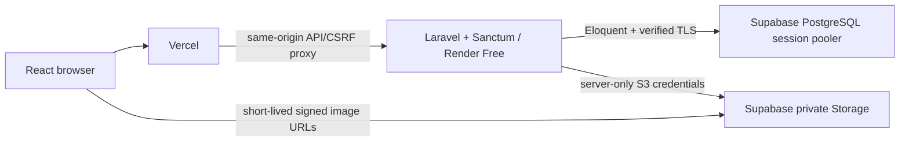

# Architecture, API and permissions

## Intended deployment

Locally Vite proxies the same routes to Laravel; PostgreSQL and private local image storage require no production credentials. Deployed Vercel proxy sessions, CSRF, private photos and backend-redeploy persistence pass; dated evidence and remaining checks are in validation.md.

Session cookies are host-only, HttpOnly, SameSite=Lax and Secure in production. The browser obtains CSRF state from `/sanctum/csrf-cookie` before writes. Laravel rotates sessions on login and invalidates logout sessions. Password changes and account suspension remove all persisted sessions. No browser bearer tokens or Supabase Auth.

Sanctum's exact stateful origins must match the final frontend hostname. Explicit CORS does not replace authentication. Production trusts provider proxy headers for scheme/client address; forwarded host is not trusted. Configure this boundary against actual Render behavior during deployment.

## Implemented schema

`users`: unique normalized email, hashed password, name, server-assigned role, active/suspended status.
`properties`: landlord foreign key, title, description, type, address/city, paired bounded coordinates, listing status, revision, moderation timestamps/reason, demo flag. Indexes cover owner/status and status/type.
`property_photos`: property foreign key, generated unique object key, disk, unique property/upload UUID, caption/order, uploading/ready/pending_deletion state.
Framework tables store database sessions/cache. Jobs table is scaffold infrastructure; no worker or scheduled service is used.

Owners submit complete drafts/rejected listings with a nonoverlapping-inventory confirmation. Submission requires description/address/paired coordinates, at least one ready photo, no unfinished photos and at least one room option with availability confirmed within 14 days. Pending submissions lock edits. Administrators review the current revision and publish or return a reason; each decision is recorded in listing_reviews. Public endpoints return approved listings only while the owner is active, excluding revision, owner identity and moderation fields. Approved/rejected rows can be edited by their owner with matching revision and become draft; pending/suspended/archived edits fail with 409. Students and unrelated landlords cannot read private properties. Foreign keys preserve records.

Photos accept JPEG/PNG/WebP ≤3MB and ≤12 megapixels, max eight/property. Laravel decodes, applies EXIF orientation, resizes to a maximum 1600px edge, strips metadata and emits JPEG. Private URLs expire after five minutes. Failed writes remain tracked for cleanup. No anonymous storage policies or direct frontend uploads.

## Implemented API

| Endpoint | Permission and behavior |
|---|---|
| GET /api/v1/health | Database/migration readiness; no credentials |
| GET /sanctum/csrf-cookie | Establish CSRF/session state |
| POST /api/v1/auth/register/student or /landlord | Fixed server role, unique email, 12-character letter/number password |
| POST /api/v1/auth/login | Active accounts; throttled; generic invalid-credential error |
| POST /api/v1/auth/logout | Authenticated active account; invalidate session |
| GET /api/v1/me | Current user's name/email/role |
| PATCH /api/v1/me | Name only; role/status/email assignment rejected |
| PATCH /api/v1/me/password | Current password required; revoke all sessions |
| GET/POST /api/v1/landlord/properties | Active landlord; owner list/create |
| GET/PATCH /api/v1/landlord/properties/{id} | Owner only; revision required on change |
| POST .../{id}/photos | Owner, editable listing, revision, upload UUID; throttled |
| DELETE .../{id}/photos/{photo} | Owner and matching property/revision; tracked deletion |
| GET /api/v1/media/{photo} | Local development only, ready photo and valid relative signature |

Collections use `data`, `links`, `meta`; resources use `data`. API errors include safe `code`, `message`, `errors`, `request_id`. Responses are not cached. Validation=422, guest=401, private ownership=404, role=403, outdated revision/locked state=409, CSRF=419, rate limit=429, storage/readiness failure=503.

## Planned permission boundaries

| Workflow | Student | Landlord | Administrator |
|---|---|---|---|
| Approved listing discovery | Yes | Yes | Yes |
| Favorites/comparison/new inquiries/reports | Own | No student actions | No student actions |
| Listing/room/photo edits | No | Own | Moderation only |
| Review unpublished listing | No | Own | Yes |
| Inquiry content and replies | Participant | Participant | **No** |
| Account moderation, reports, audit | No | Own listing outcome | Yes |

Administrator inquiry metadata excludes message bodies and previews. Operational database credentials are a separate privileged boundary.

## Phase 2 schema and rules

Properties have multiple room options; options describe nonoverlapping equivalent bedspace or whole-room inventory. Integer centavos represent monthly PHP rent, deposits and fixed fees, with per-person/per-room basis explicitly distinguished. Same-option predicates govern price plus availability filters; no cross-option false matches. Available units cannot exceed total; confirmations older than 14 days are stale.

Implemented room_options, room_option_fees, listing_reviews, inquiries and inquiry_messages. Room options are soft-deleted to preserve thread references. Public comparison validates up to three distinct properties and an option that belongs to each. Charges are integer centavos; fixed monthly totals include rent plus monthly fees, while the separately labeled deposit/advance/one-time total excludes variable utilities and rent not covered by the advance.

Inquiries have one unique student/property thread and an immutable initial listing/option snapshot. Messages require a sender/thread/client UUID; identical retries return the original result and reused UUIDs with different bodies conflict. Lists/detail/messages/replies are participant-scoped, including administrator denial. Reads survive draft/rejected/archived states; suspended listings or participants freeze new replies. Property locks precede inquiry locks.

Later entities: campuses; amenities/pivot; favorites; notifications; listing_reports; moderation_actions. Unique favorite pair, student/property thread, sender/thread/message UUID and recipient/event prevent duplicates. Comparison validates at most three unique public properties and matching selected options.

Review checks completeness, understandable charges, plausible address/pin, relevant images, misleading/prohibited content and obvious duplicates. Approval is content review, not safety inspection or ownership/legal certification. Material edits hide listings until reapproved. Archived/rejected/edited listings preserve inquiries; suspended listings freeze replies. Landlord suspension hides listings and revokes sessions; reactivation does not republish them.

TIP Manila Casal reference coordinates remain unverified. Distance will be backend-calculated approximate straight-line distance, never walking distance. Later campuses fit the model. Synthetic listings/images will be labeled demo data.

## Phase 2 API additions

- GET /api/v1/listings and /listings/{id}: approved listings for active owners, paginated browse and public details.
- POST /api/v1/compare: active student; one to three unique public-property/room-option selections.
- POST/PATCH/DELETE /api/v1/landlord/properties/{id}/room-options[/{option}]: owner only, matching property revision, editable states; saving confirms availability and demotes publication.
- POST .../{id}/submit: completeness, revision and inventory confirmation; draft/rejected → pending_review.
- GET /api/v1/admin/reviews[/{id}] and POST .../{id}/decision: active administrator; current pending revision, review confirmation and rejection reason.
- GET /api/v1/inquiries[/{id}] and /inquiries/{id}/messages; POST /listings/{id}/inquiries and /inquiries/{id}/messages: participants only, throttled writes, retry UUIDs and bounded pagination.
- Readiness requires the Phase 2 migration and reports phase 2.
